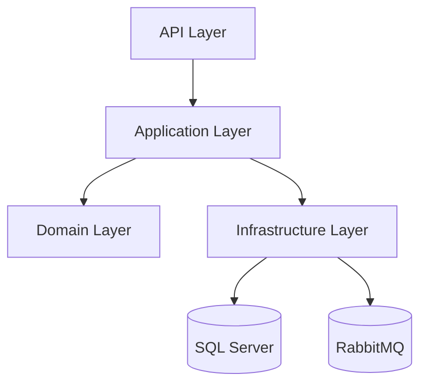
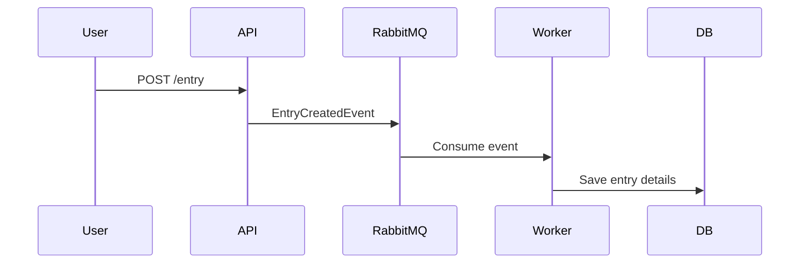

# 📘 Sozluk Project

This is a modern dictionary (sozluk) application designed with clean architecture principles, scalable patterns, and modular practices. It follows Onion Architecture, CQRS, and Event-Driven Design using robust .NET technologies.

---

## 🛠️ Technologies and Tools Used

### ⚙️ Architectural Design

- **Onion Architecture**: Domain-centric structure with clear dependency direction (inside-out).
- **CQRS (Command Query Responsibility Segregation)**: Separates read and write operations for better scalability and maintainability.
- **Event-Driven Architecture**: Uses RabbitMQ for asynchronous workflows and background processing.

### 📚 Libraries & Frameworks

- Entity Framework Core
- Dapper (for high-performance queries)
- MediatR (CQRS and mediator pattern)
- AutoMapper (object mapping)
- FluentValidation (input validation)
- RabbitMQ (message queue for background jobs)

### 🗃️ Database

- Microsoft SQL Server

### 💻 Programming Language

- C#

---

## 🚀 Features

- ✅ User Registration and Authentication (Login)
- ✅ Entry and Comment Management
- ✅ Voting System for Entries and Comments
- ✅ Asynchronous Event Handling via RabbitMQ
- ✅ Input Validation with FluentValidation

---

## 📂 Project Structure

```
Sozluk/
│
├── API               → Entry point (controllers, endpoints)
├── Application       → Business rules, CQRS (Commands, Queries)
├── Domain            → Core domain models and interfaces
├── Infrastructure    → DB, RabbitMQ, service implementations
└── WorkerService     → Consumes events from RabbitMQ
```

---

## 📐 Architecture Diagrams

### 🧱 Onion Architecture



---

### 🔄 Event-Driven Flow (RabbitMQ)



---

### 🧠 CQRS Pattern

```mermaid
graph LR
    A[Client Request] --> B{Command or Query?}
    B -->|Command| C[Command Handler (via MediatR)]
    B -->|Query| D[Query Handler (via MediatR)]
    C --> DB[(Write DB)]
    D --> DB[(Read DB)]
```

---

## 🧪 Getting Started

### 🐘 Prerequisites

- .NET 7 SDK or higher
- Microsoft SQL Server
- RabbitMQ Server (installed and running)

---

### 🔧 Installation

```bash
git clone https://github.com/Yusuftmle/Sozluk.git
cd Sozluk
dotnet restore
```

### ⚙️ Configuration

Update your `appsettings.json` with your local SQL Server connection string:

```json
"ConnectionStrings": {
  "DefaultConnection": "Server=localhost;Database=SozlukDb;User Id=sa;Password=yourStrong(!)Password;"
}
```

---

### ▶️ Running the Application

1. Make sure SQL Server and RabbitMQ are running.
2. Apply migrations if needed (EF Core).
3. Run the API and Worker service:

```bash
dotnet run --project src/Api/Sozluk.Api
dotnet run --project src/Worker/Sozluk.WorkerService
```

---

## 🧠 Developer Notes

This project follows SOLID principles and a clean, maintainable architecture. It is modular, scalable, and production-ready. Features like MediatR, Event-Driven design, and CQRS improve separation of concerns and decoupling.

---

## 🔬 Future Improvements

- ✅ Add unit & integration tests (xUnit)
- ✅ Add Swagger & Postman collection
- ✅ Add Docker support for SQL + RabbitMQ + API
- ✅ Add GitHub Actions for CI/CD
- ✅ Add OpenTelemetry/Serilog for observability

---

## 📖 References

- [Clean Architecture by Uncle Bob](https://8thlight.com/blog/uncle-bob/2012/08/13/the-clean-architecture.html)
- [MediatR Documentation](https://github.com/jbogard/MediatR)
- [AutoMapper Documentation](https://automapper.org/)
- [RabbitMQ .NET Client](https://www.rabbitmq.com/dotnet.html)

---

## 🤝 Contributing

Feel free to fork this repo, create feature branches, and submit PRs! Any suggestions or feedback are welcome.

---

## 📬 Contact

If you liked this project, follow me on [GitHub](https://github.com/Yusuftmle) or reach out for collaboration!

---
